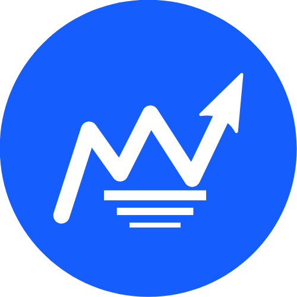

# Portman

Portman is a trading terminal and exchange platform built entirely from scratch. Although still active in development, It will support a large variety of financial instruments such as Perpetuals trading, liquidity staking and several others. It uses a variety of programming languages that I have picked up over the years and want to showcase in a single product. Features such as asset management and analysis and technical indicators are also on my roadmap.

  

