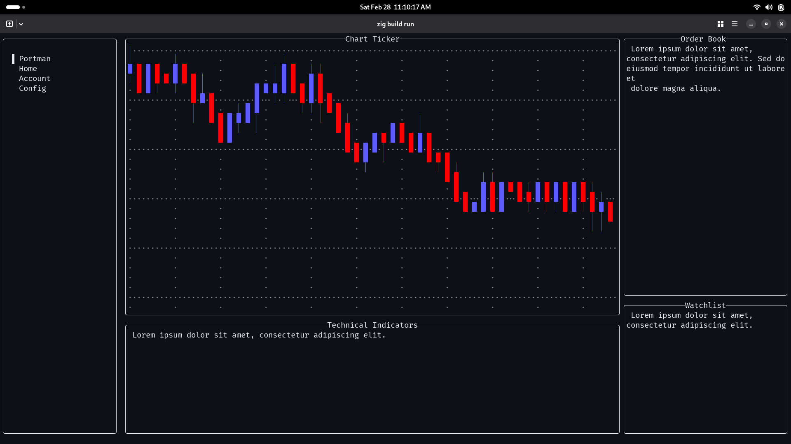

# Portman

  

Portman is a high-performance, terminal-native trading exchange and terminal built from the ground up. It delivers a lock-free order book, a "hacker" Terminal UI powered by the Kitty Protocol, and a programmable system that lets you script and deploy your own strategies. With 1:1 on-chain liquidity backing and integrated automated market-making, Portman is built for trust and uptime.

## Project Status

Portman is designed as a distributed system where each component is written in the language best suited for its specific constraints.

  

| Status  | Component | Language | Progress           |
| :-----: | --------- | :------: | :----------------- |
|  Beta   | Core      |   Rust   | `[██████----] 60%` |
|         | API       |    Go    | `[████████--] 80%` |
|         | Bots      |  Python  | `[█████-----] 50%` |
|  Alpha  | UI        |   Zig    | `[██--------] 20%` |
| Planned | Base      | Solidity | `[----------]  0%` |
|         | Hooks     |   Lua    | `[----------]  0%` |

## FAQs

### Why a Polyglot Stack?

I chose a polyglot stack to leverage the strengths of different ... yada yada ... I just wanted to have fun exploring multiple languages in one project.

### Why Build in the Terminal?

TUI applications look cool and Portman should give me more street cred.
